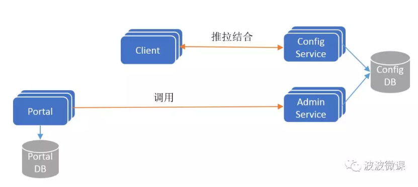
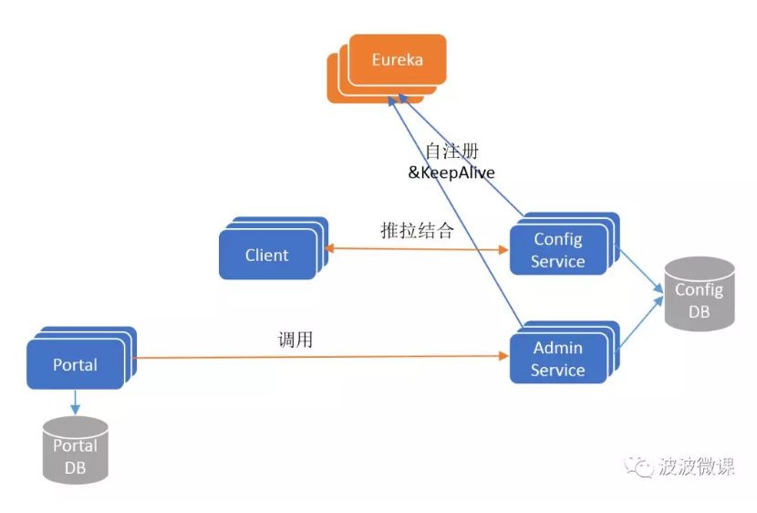
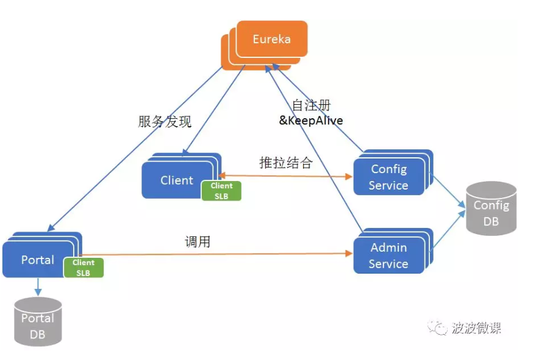
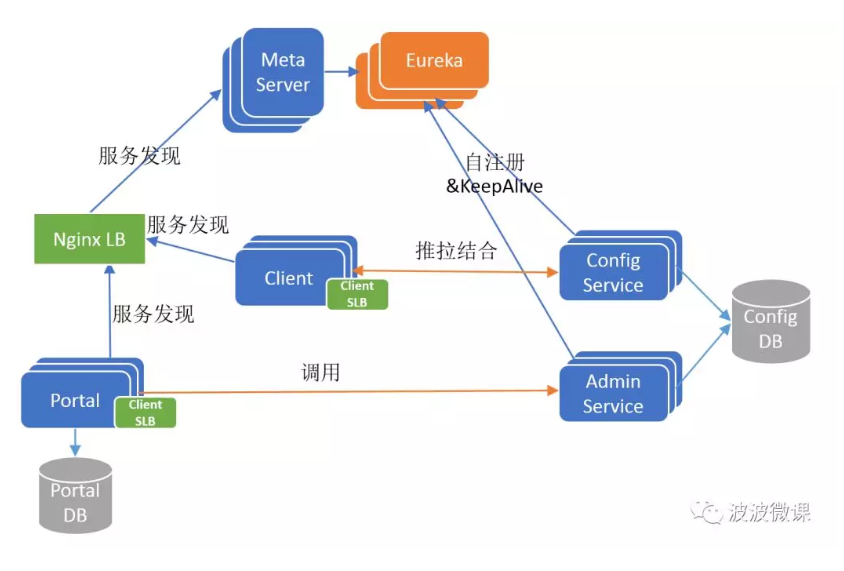
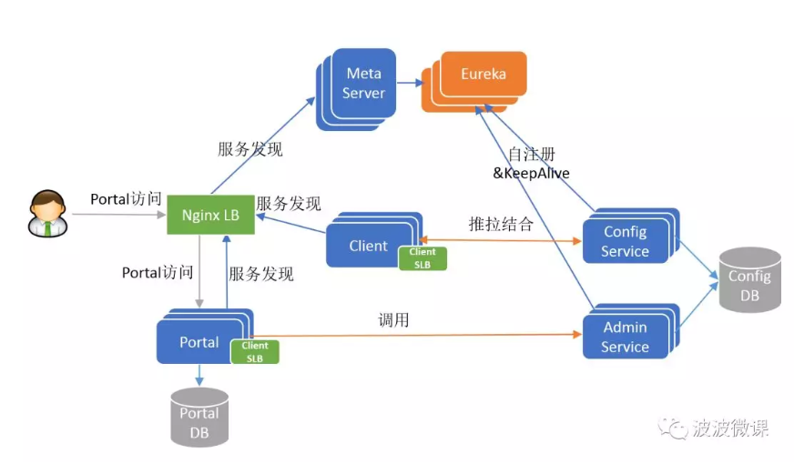
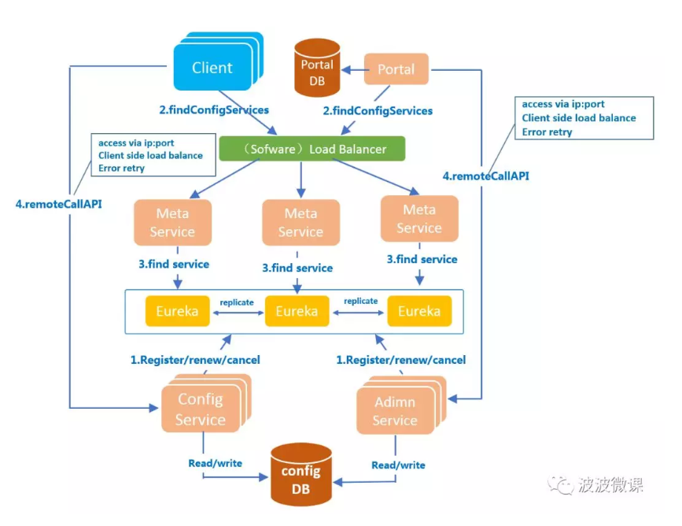

# 配置中心

## 为什么需要配置中心

+ 配置治理
+ 权限管控
+ 灰度发布
+ 版本发布管理
+ 版本回滚
+ 版本审计
+ 格式校验
+ 配置管理（application，namespace，cluster、env）
+ 实时生效（热发布）

## 配置中心选型

| apollo   |      nacos      |consul
|----------|:-------------:|------|
| UI | 高 | 高 | 低
|权限控制|  支持| 支持 | 不支持
|服务发现 | 不支持 | 支持 | 支持
| 可用性 | 高 | 高 | 高
| 部署复杂度| 简单 | 简单 | 一般
| 应用维度| 支持 |不支持 | 不支持
|支持多语言接入|支持 |支持 | 支持
|二次开发|简单 |一般 | 难

分析对比、可用性、webui、部署复杂度、权限控制等，其中最重要的一点是只有apollo支持以应用为维度进行配置管理，所以选型apollo作为配置治理平台。

## 架构解析

### 四大核心模块

1. ConfigService

    * 提供配置获取接口
    * 提供配置推送接口
    * 服务于apollo客户端
    
2. AdminService
    
    * 提供配置管理接口
    * 提供配置修改发布接口
    * 服务于管理界面Portal
    
3. Client

    * 为应用获取配置，支持实时更新
    * 通过MetaServer获取ConfigService的服务列表
    * 使用客户端负载均衡SLB方式调用ConfigService
   
4. Portal

    * 配置管理界面
    * 通过MetaServer获取AdminServiced的服务列表
    * 使用客户端软负载SLB方式调用AdminService
    
### 三个辅助服务发现模块

1. Eureka
    
    * 用于服务发现和注册
    * Config/Admin注册实例并且定期报心跳
    
2. MetaServer
   
   * Portal通过域名访问Metaserver获取adminservice地址列表
   * client通过域名访问Metaserver获取ConfigService地址列表
   * 相当于一个eureka proxy
   
3. Nginx
    对于metaserver做软负载均衡
    
### 架构演进

1. V1

2. V2

3. V3

4. V4

5. V5

6. 俯视角

