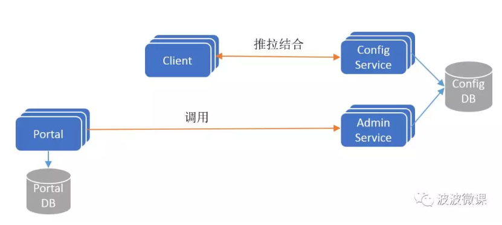
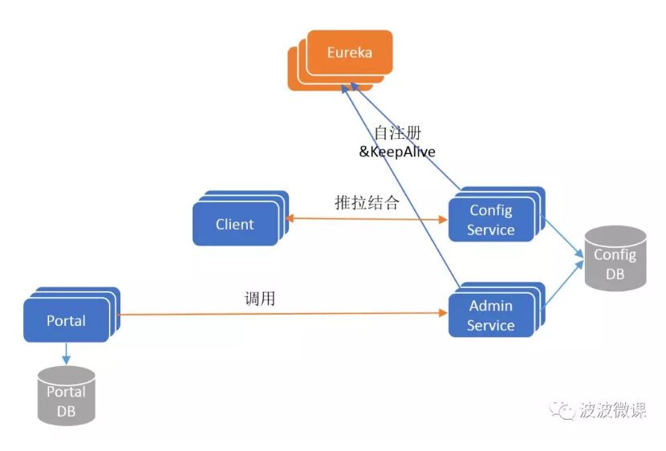
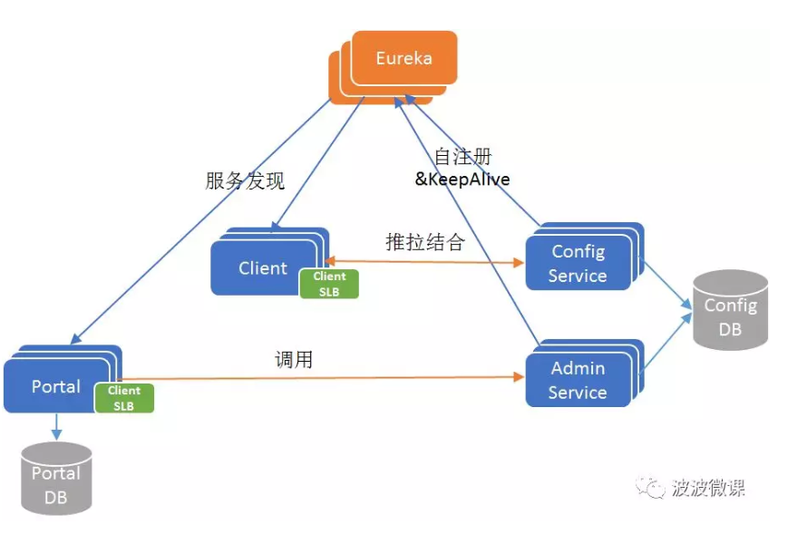
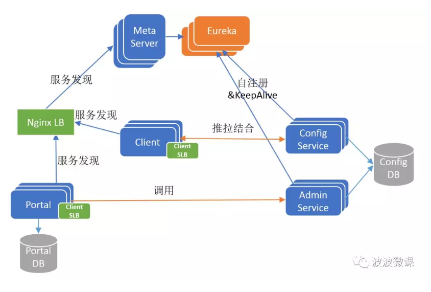
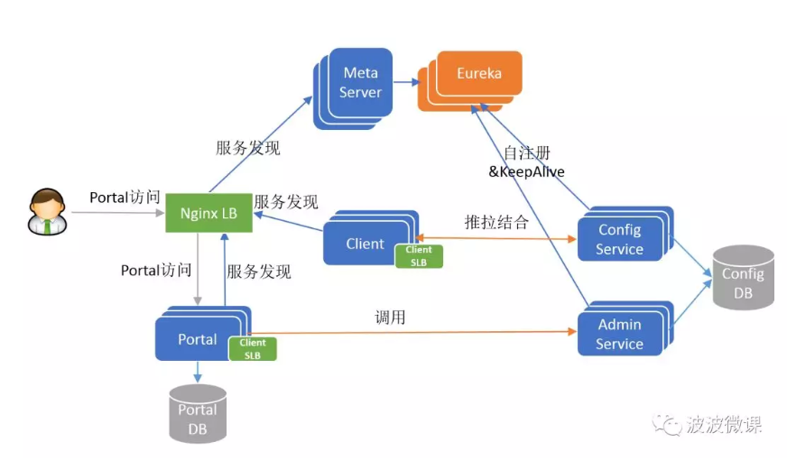
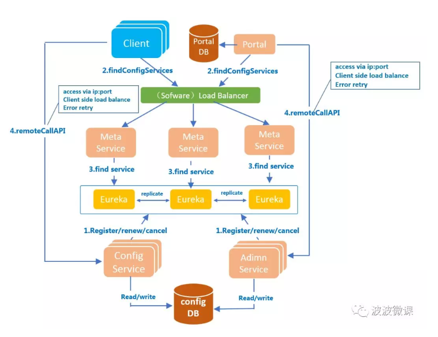
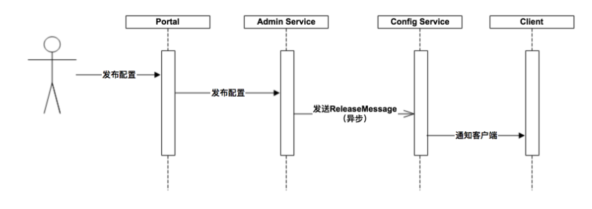
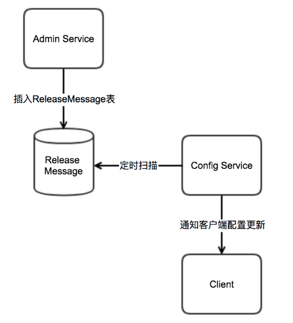
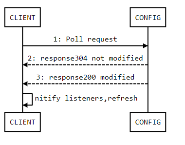
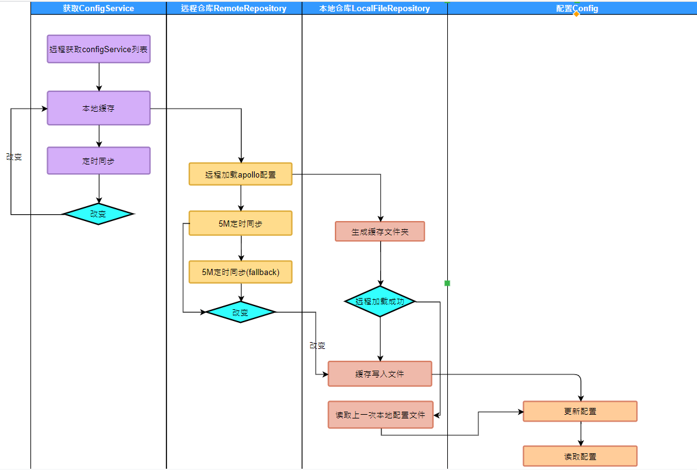

# 配置中心


## 一、为什么需要配置中心

+ 配置管理（application，namespace，cluster、env）
+ 配置治理
+ 权限管控
+ 灰度发布
+ 版本发布管理
+ 版本回滚
+ 版本审计
+ 格式校验

+ 实时生效（热发布）
+ 配置模板复用

## 二、配置中心选型

| apollo   |      nacos      |consul
|----------|:-------------:|------|
| UI | 高 | 高 | 低
|权限控制|  支持| 支持 | 不支持
|服务发现 | 不支持 | 支持 | 支持
| 可用性 | 高 | 高 | 高
| 部署复杂度| 简单 | 简单 | 一般
| 应用维度| 支持 |不支持 | 不支持
|支持多语言接入|支持 |支持 | 支持
|二次开发|简单 |一般 | 难

分析对比、可用性、webui、部署复杂度、权限控制等，其中最重要的一点是只有apollo支持以应用为维度进行配置管理，所以选型apollo作为配置治理平台。


## 三、架构设计

### 3.1 四大核心模块

1. ConfigService

    * 提供配置获取接口
    * 提供配置推送接口
    * 服务于apollo客户端
    
2. AdminService
    
    * 提供配置管理接口
    * 提供配置修改发布接口
    * 服务于管理界面Portal
    
3. Client

    * 为应用获取配置，支持实时更新
    * 通过MetaServer获取ConfigService的服务列表
    * 使用客户端负载均衡SLB方式调用ConfigService
   
4. Portal

    * 配置管理界面
    * 通过MetaServer获取AdminServiced的服务列表
    * 使用客户端软负载SLB方式调用AdminService
    
### 3.2 三个辅助服务发现模块

1. Eureka
    
    * 用于服务发现和注册
    * Config/Admin注册实例并且定期报心跳
    
2. MetaServer
   
   * Portal通过域名访问Metaserver获取adminservice地址列表
   * client通过域名访问Metaserver获取ConfigService地址列表
   * 相当于一个eureka proxy
   
3. Nginx
    对于metaserver做软负载均衡
    
### 3.3 架构演进

1. V1



2. V2



3. V3



4. V4



5. V5



6. 俯视角




### 3.4 服务端设计

#### 3.4.1 配置发布后的实时推送设计



简单描述了配置发布的大致过程

1. 用户在portal操作配置发布
2. Portal调用Admin Service的接口操作发布
3. Admin Service发布配置后，发送ReleaseMessage给各个Config Service
4. Config Service收到ReleaseMessage后，通知对应的客户端

#### 3.4.2 发送releaseMessage的实现方式

Admin Service在配置发布后，需要通知所有Config Service，这是个典型的消息使用场景，在实现上，为了尽量减少外部依赖，通过数据库实现了简单消息队列

1. AdminService在配置发布后往表里插入一条消息
2. ConfigService会有一个线程每条扫描，查看是否有新消息
3. ConfigService如果发现有新的消息，就会通知所有的消息监听器
4. 通知客户端消息变更




### 3.5 客户端设计

1. 客户端和服务端保持了一个长连接，从而可以第一时间获得配置更新的推送
2. 定时从apollo拉取最新的配置，fallback机制
3. 获取最新配置，保存于内存
4. 在服务不可用，或者网路不通时，配置从上一次成功本地写入的配置文件获取
5. 时刻关注配置变更，变更通知监听器处理相应操作

长连接时序图



客户端调用流程图  




## 四、使用指南

### 4.1 核心概念

1. application(应用)

    * 就是实际使用配置的应用，Apollo客户端在运行时需要知道当前应用是谁，从而可以去获取对应的配置
    * 每个应用都需要有唯一的身份标识 -- appId

2. environment(环境)
    * 配置对应的环境，Apollo客户端在运行时需要知道当前应用处于哪个环境，从而可以去获取应用的配置
    * 同一份代码部署在不同的环境就应该能够获取到不同环境的配置

3. cluster(集群) 
    * 一个应用下不同实例的分组，比如典型的可以按照数据中心分，把上海机房的应用实例分为一个集群，把北京机房的应用实例分为另一个集群

4. namespace(命名空间)
    * 一个应用下不同配置的分组，可以简单地把namespace类比为文件，不同类型的配置存放在不同的文件中，如数据库配置文件，RPC配置文件，应用自身的配置文件等
    * 应用可以直接读取到公共组件的配置namespace，如DAL，RPC等
    * 应用也可以通过继承公共组件的配置namespace来对公共组件的配置做调整，如DAL的初始数据库连接数
    
    
官方使用手册
https://github.com/ctripcorp/apollo/wiki/Apollo%E4%BD%BF%E7%94%A8%E6%8C%87%E5%8D%97  

## 五、语言接入

官方目前支持java以及.net，其他语言接入使用github上开源sdk  

### 5.1 NODEJS

github的sdk地址(非官方)  
https://github.com/kaelzhang/ctrip-apollo

由于我nodejs经验有限，抛砖引玉

init  
```bash
const apollo = require('ctrip-apollo')
var host = 'http://10.100.100.20:8080'
var appId = '001'
var ok = 0
const ns = apollo({
	host,
	appId
  }).cluster('default').namespace('application')
  
async function getProperty(slice) {
	var result = []
	try {
		if(ok == 0) {
			await ns.ready()
			ok = 1
		}
		for(var key in slice) {
			result.push(ns.get(key))
		}
		return result
	}catch(err) {
		log.err("config error!!!")
		for(var key in slice) {
			result.push(slice[key])
		}
		return result
	}
}
```

调用  

```bash
getProperty({"DEBUG": "AAA", "ALLOWED_HOSTS": "BBB"}).then(data =>{
		
		var var1 = data[0] == undefined ? "1" : data[0]
		var var2 = data[1] == undefined ? "2" : data[0]
		console.log(var1, var2)
	})
```


### 5.2 PYTHON

github的sdk地址(非官方) 

https://github.com/filamoon/pyapollo  


